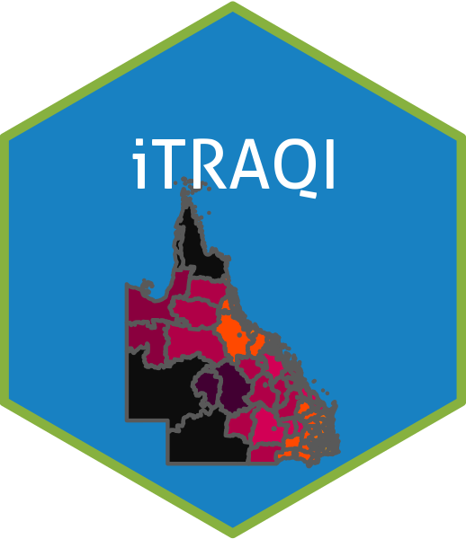

# iTRAQI: injury Treatment & Rehabilitation Accessibility Queensland Index 

This repository includes the code and data used within the iTRAQI shiny app.

This app is hosted here <https://aushsi.shinyapps.io/itraqi_app/> and it's code is available here <https://github.com/RWParsons/iTRAQI_app/>.

The analyses code in this repository is described in the technical report here <https://eprints.qut.edu.au/235026/>.

### Helpful resources used during this project:
* kriging <https://rpubs.com/nabilabd/118172>
* plots <https://r-spatial.github.io/sf/articles/sf5.html>
* understanding crs <https://www.earthdatascience.org/courses/earth-analytics/spatial-data-r/understand-epsg-wkt-and-other-crs-definition-file-types/>
* changing crs <https://stackoverflow.com/questions/50372533/changing-crs-of-a-sf-object>
* spatial aggregations <https://cengel.github.io/R-spatial/spatialops.html>
