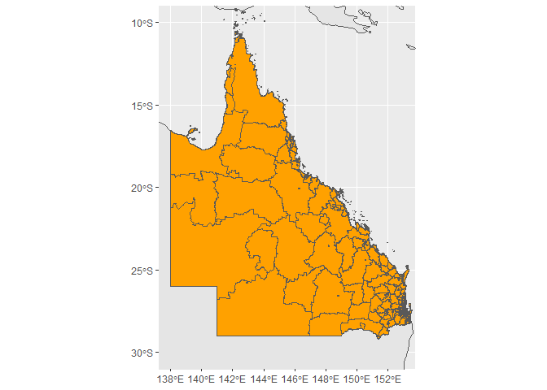

iTRAQI
================
23 February, 2022

#### resources used:

-   kriging <https://rpubs.com/nabilabd/118172>
-   plots <https://r-spatial.github.io/sf/articles/sf5.html>
-   understanding crs
    <https://www.earthdatascience.org/courses/earth-analytics/spatial-data-r/understand-epsg-wkt-and-other-crs-definition-file-types/>
-   changing crs
    <https://stackoverflow.com/questions/50372533/changing-crs-of-a-sf-object>
-   spatial aggregations
    <https://cengel.github.io/R-spatial/spatialops.html>

# load inputs

``` r
df_times <- read.csv("input/QLD_locations_with_RSQ_times_20220210.csv")
coordinates(df_times) <- ~ x + y

qld_bounary <- st_read("input/qld_state_polygon_shp/QLD_STATE_POLYGON_shp.shp")
```

    ## Reading layer `QLD_STATE_POLYGON_shp' from data source 
    ##   `C:\Users\Rex\Documents\R_projects\iTRAQI\input\qld_state_polygon_shp\QLD_STATE_POLYGON_shp.shp' 
    ##   using driver `ESRI Shapefile'
    ## Simple feature collection with 2031 features and 6 fields
    ## Geometry type: POLYGON
    ## Dimension:     XY
    ## Bounding box:  xmin: 137.996 ymin: -29.1779 xmax: 153.5552 ymax: -9.141203
    ## Geodetic CRS:  GDA94

``` r
qld_SAs <- st_read("input/qld_sa_zones/MB_2016_QLD.shp")
```

    ## Reading layer `MB_2016_QLD' from data source 
    ##   `C:\Users\Rex\Documents\R_projects\iTRAQI\input\qld_sa_zones\MB_2016_QLD.shp' 
    ##   using driver `ESRI Shapefile'
    ## replacing null geometries with empty geometries
    ## Simple feature collection with 69764 features and 16 fields (with 25 geometries empty)
    ## Geometry type: POLYGON
    ## Dimension:     XY
    ## Bounding box:  xmin: 137.9943 ymin: -29.1779 xmax: 153.5522 ymax: -9.142176
    ## Geodetic CRS:  GDA94

``` r
# ggplot(data = world) +
#   geom_sf() +
#   geom_sf(data=qld_SAs, aes(fill=SA3_NAME16), col = NA) +
#   coord_sf(xlim = c(100.00, 160.00), ylim = c(-45.00, -10.00), expand = T) + 
#   guides(fill="none")
```

# base map and points

``` r
world <- ne_countries(scale = "medium", returnclass = "sf")
ggplot(data = world) +
  geom_sf() +
  geom_sf(data=qld_bounary, color="blue") +
  labs( x = "Longitude", y = "Latitude") +
  annotation_scale(location = "bl", width_hint = 0.5) +
  geom_sf(data=qld_SAs, aes(fill=SA3_NAME16), col = NA) +
  geom_point(data=as.data.frame(df_times), aes(x,y))+ 
  guides(fill="none") +
  coord_sf(xlim = c(100.00, 160.00), ylim = c(-45.00, -10.00), expand = T)
```

    ## Scale on map varies by more than 10%, scale bar may be inaccurate

<!-- -->

# kriging - select variogram model (Gaussian looks best)

``` r
lzn_vgm <- variogram(acute_time~1, df_times)
lzn_fit <- fit.variogram(lzn_vgm, model=vgm("Gau"))

plot(lzn_vgm, lzn_fit)
```

<!-- -->

``` r
# show.vgms()
```

# kriging - create spatial domain to interpolate over

``` r
map <- read_sf("input/qld_state_polygon_shp/QLD_STATE_POLYGON_shp.shp")
aus <- raster::getData('GADM', country = 'AUS', level = 1)
grid <- makegrid(aus[aus$NAME_1 == "Queensland",], cellsize = 0.1)
pnts_sf <- st_as_sf(grid, coords = c('x1', 'x2'), crs = st_crs(map))

pnts <- pnts_sf %>% mutate(
  intersection = as.integer(st_intersects(geometry, map))
) %>%
  filter(!is.na(intersection)) %>%
  st_coordinates() %>% 
  as.data.frame()
coordinates(pnts) <- ~ X + Y
```

# kriging - generate interpolations

``` r
lzn_kriged <- krige(acute_time ~ 1, df_times, pnts, model=lzn_fit)%>%
  as.data.frame
```

    ## [using ordinary kriging]

``` r
lzn_kriged %>%
  ggplot(aes(X, Y)) + 
  geom_tile(aes(fill=var1.pred)) + 
  coord_equal()+
  scale_fill_gradient(low = "yellow", high="red")
```

<!-- -->

# add interpolation layer to map

``` r
ggplot(data = world) +
  geom_sf() +
  geom_sf(data=qld_bounary, color="blue") +
  labs( x = "Longitude", y = "Latitude") +
  coord_sf(xlim = c(100.00, 160.00), ylim = c(-45.00, -10.00), expand = T) +
  annotation_scale(location = "bl", width_hint = 0.5) +
  geom_tile(data=lzn_kriged, aes(X, Y, fill=var1.pred)) +
  geom_point(data=as.data.frame(df_times), aes(x,y)) +
  scale_fill_gradient(low = "yellow", high="red")
```

    ## Scale on map varies by more than 10%, scale bar may be inaccurate

<!-- -->

# spatial join from SA1 and SA2 polygons to interpolated values

``` r
coordinates(lzn_kriged) <- ~ X + Y
lzn_kriged_sf <- st_as_sf(lzn_kriged)

qld_SAs <- st_transform(qld_SAs, crs = 4326)
lzn_kriged_sf <- st_set_crs(lzn_kriged_sf, 4326)
lzn_kriged_sf <- st_transform(lzn_kriged_sf, crs = 4326)

test <- st_join(qld_SAs, lzn_kriged_sf)

test2 <- 
  test %>% 
  na.omit() %>%
  group_by(SA2_NAME16) %>%
  mutate(mean=mean(var1.pred, na.omit=TRUE)) %>% 
  ungroup()

length(unique(test$SA2_NAME16))
```

    ## [1] 530

``` r
length(unique(test2$SA2_NAME16))
```

    ## [1] 188

``` r
ggplot(data = world) +
  geom_sf() +
  geom_sf(data=test2, aes(fill=mean), col = NA) +
  # coord_sf(xlim = c(100.00, 160.00), ylim = c(-45.00, -10.00), expand = T) +
  coord_sf(xlim = c(138, 153.00), ylim = c(-30.00, -10.00), expand = T) +
  guides(fill="none") +
  scale_fill_gradient(low = "yellow", high="red")
```

<!-- -->

# try to join the SA1 polygons together: <https://gis.stackexchange.com/questions/63577/joining-polygons-in-r>
