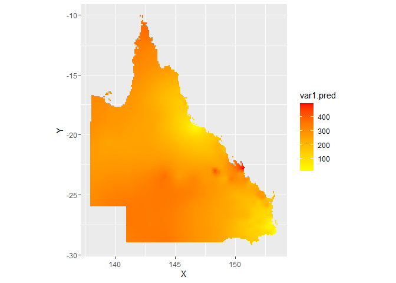
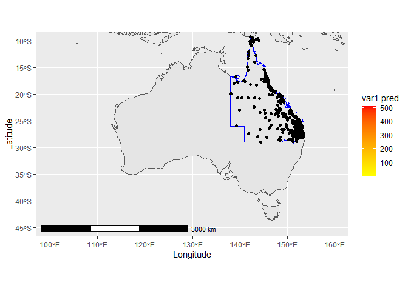
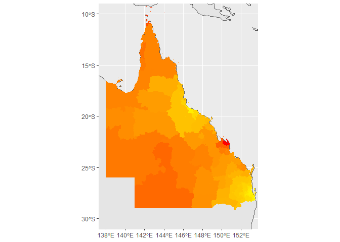

iTRAQI
================
02 March, 2022

#### resources used:

-   kriging <https://rpubs.com/nabilabd/118172>
-   plots <https://r-spatial.github.io/sf/articles/sf5.html>
-   understanding crs
    <https://www.earthdatascience.org/courses/earth-analytics/spatial-data-r/understand-epsg-wkt-and-other-crs-definition-file-types/>
-   changing crs
    <https://stackoverflow.com/questions/50372533/changing-crs-of-a-sf-object>
-   spatial aggregations
    <https://cengel.github.io/R-spatial/spatialops.html>

# load inputs

``` r
df_times <- read.csv("input/QLD_locations_with_RSQ_times_20220210.csv")
coordinates(df_times) <- ~ x + y

qld_bounary <- read_sf("input/qld_state_polygon_shp/QLD_STATE_POLYGON_shp.shp")
world <- ne_countries(scale = "medium", returnclass = "sf")
qld_SAs <- st_read("input/qld_sa_zones/MB_2016_QLD.shp")
```

    ## Reading layer `MB_2016_QLD' from data source 
    ##   `C:\Users\Rex\Documents\R_projects\iTRAQI\input\qld_sa_zones\MB_2016_QLD.shp' 
    ##   using driver `ESRI Shapefile'
    ## replacing null geometries with empty geometries
    ## Simple feature collection with 69764 features and 16 fields (with 25 geometries empty)
    ## Geometry type: POLYGON
    ## Dimension:     XY
    ## Bounding box:  xmin: 137.9943 ymin: -29.1779 xmax: 153.5522 ymax: -9.142176
    ## Geodetic CRS:  GDA94

``` r
# ggplot(data = world) +
#   geom_sf() +
#   geom_sf(data=qld_SAs, aes(fill=SA3_NAME16), col = NA) +
#   coord_sf(xlim = c(100.00, 160.00), ylim = c(-45.00, -10.00), expand = T) + 
#   guides(fill="none")
```

# base map and points

``` r
ggplot(data = world) +
  geom_sf() +
  geom_sf(data=qld_bounary, color="blue") +
  labs( x = "Longitude", y = "Latitude") +
  annotation_scale(location = "bl", width_hint = 0.5) +
  geom_sf(data=qld_SAs, aes(fill=SA3_NAME16), col = NA) +
  geom_point(data=as.data.frame(df_times), aes(x,y))+ 
  guides(fill="none") +
  coord_sf(xlim = c(100.00, 160.00), ylim = c(-45.00, -10.00), expand = T)
```

    ## Scale on map varies by more than 10%, scale bar may be inaccurate

<!-- -->

# kriging - create spatial domain to interpolate over

``` r
aus <- raster::getData('GADM', country = 'AUS', level = 1)
grid <- makegrid(aus[aus$NAME_1 == "Queensland",], cellsize = 0.1)
pnts_sf <- st_as_sf(grid, coords = c('x1', 'x2'), crs = st_crs(qld_bounary))

pnts <- pnts_sf %>% mutate(
  # https://gis.stackexchange.com/a/343479
  intersection = as.integer(st_intersects(geometry, qld_bounary))
) %>%
  filter(!is.na(intersection)) %>%
  st_coordinates() %>% 
  as.data.frame()

# add centroids of all polygons to pnts to ensure there's at least one interpolated value within
centroids <- 
  qld_SAs %>%
  st_centroid() %>%
  st_coordinates() %>%
  na.omit() %>% 
  as.data.frame()
```

    ## Warning in st_centroid.sf(.): st_centroid assumes attributes are constant over
    ## geometries of x

``` r
pnts2 <- rbind(pnts, centroids)
coordinates(pnts) <- ~ X + Y
coordinates(pnts2) <- ~ X + Y
```

# kriging - select variogram model

### Gaussian looks best but Spherical matches expectation

``` r
# "Gau" model gives better model fit but does not match up with our 
# interpolations in ArcGIS like the Spherical ("Sph") option does
vgm_model <- "Sph" # Exc or Cir looks best for acute

# acute variogram
lzn_vgm <- variogram(acute_time~1, df_times)
lzn_fit_acute <- fit.variogram(lzn_vgm, model=vgm(vgm_model))
plot(lzn_vgm, lzn_fit_acute)
```

<!-- -->

``` r
vgm_model <- "Sph" # Sph or Cir looks best for rehab (most sensible interpolations)
# rehab variogram
lzn_vgm <- variogram(rehab_time~1, df_times)
lzn_fit_rehab <- fit.variogram(lzn_vgm, model=vgm(vgm_model))
```

    ## Warning in fit.variogram(lzn_vgm, model = vgm(vgm_model)): No convergence after
    ## 200 iterations: try different initial values?

``` r
plot(lzn_vgm, lzn_fit_rehab)
```

<!-- -->

``` r
show.vgms()
```

<!-- -->

# kriging - generate interpolations

``` r
lzn_kriged_acute <- krige(acute_time ~ 1, df_times, pnts2, model=lzn_fit_acute)%>%
  as.data.frame()
```

    ## [using ordinary kriging]

``` r
krige(acute_time ~ 1, df_times, pnts, model=lzn_fit_acute)%>%
  as.data.frame() %>%
  ggplot(aes(X, Y)) + 
  geom_tile(aes(fill=var1.pred)) + 
  coord_equal()+
  scale_fill_gradient(low = "yellow", high="red")
```

    ## [using ordinary kriging]

<!-- -->

``` r
lzn_kriged_rehab <- krige(rehab_time ~ 1, df_times, pnts2, model=lzn_fit_rehab)%>%
  as.data.frame()
```

    ## [using ordinary kriging]

``` r
krige(rehab_time ~ 1, df_times, pnts, model=lzn_fit_rehab)%>%
  as.data.frame() %>%
  ggplot(aes(X, Y)) + 
  geom_tile(aes(fill=var1.pred)) + 
  coord_equal()+
  scale_fill_gradient(low = "yellow", high="red")
```

    ## [using ordinary kriging]

<!-- -->

``` r
# save the kriging interpolation layers that don't have the supplementary coordinates within SA1s
# These are used for the web app, whereas the 'lzn_kriged___' are used for aggregations.
krige(acute_time ~ 1, df_times, pnts, model=lzn_fit_acute) %>% 
  as.data.frame() %>%
  rasterFromXYZ(crs=4326) %>%
  saveRDS("input/layers/kriged_acute.rds")
```

    ## [using ordinary kriging]

``` r
krige(rehab_time ~ 1, df_times, pnts, model=lzn_fit_rehab) %>% 
  as.data.frame() %>%
  rasterFromXYZ(crs=4326) %>%
  saveRDS("input/layers/kriged_rehab.rds")
```

    ## [using ordinary kriging]

# add interpolation layer to map

``` r
ggplot(data = world) +
  geom_sf() +
  geom_sf(data=qld_bounary, color="blue") +
  labs( x = "Longitude", y = "Latitude") +
  coord_sf(xlim = c(100.00, 160.00), ylim = c(-45.00, -10.00), expand = T) +
  annotation_scale(location = "bl", width_hint = 0.5) +
  geom_tile(data=lzn_kriged_acute, aes(X, Y, fill=var1.pred)) +
  geom_point(data=as.data.frame(df_times), aes(x,y)) +
  scale_fill_gradient(low = "yellow", high="red")
```

    ## Scale on map varies by more than 10%, scale bar may be inaccurate

<!-- -->

# Join the SA polygons together depending on level (SA1 vs SA2)

``` r
do_union <- function(x){
  pb$tick()
  st_union(x, is_coverage = TRUE)
}

aggregate_by_SA <- function(qld_sf, SA_number, use_dissolve=FALSE){
  sa_main <- glue::glue('SA{SA_number}_{ifelse(SA_number %in% c(3,4), "CODE", "MAIN")}16')
  message(glue::glue('----- grouping polygons within SA{SA_number} -----'))
  if(use_dissolve){
    return(rmapshaper::ms_dissolve(qld_sf, sa_main))
  }
  
  num_ticks <- length(unique(qld_sf[[sa_main]]))
  pb <<- progress_bar$new(
    format = "[:bar] :current/:total (:percent) elapsed :elapsed eta :eta", 
    total=num_ticks
  )
  
  qld_sf %>%
    # https://gis.stackexchange.com/questions/321281/using-sf-to-combine-polygons-that-share-borders
    group_by(across(all_of(sa_main))) %>%
    summarize(geometry=do_union(geometry))
}

qld_SA2s <- aggregate_by_SA(qld_sf=qld_SAs, SA_number=2, use_dissolve=TRUE)
```

    ## ----- grouping polygons within SA2 -----

    ## Registered S3 method overwritten by 'geojsonlint':
    ##   method         from 
    ##   print.location dplyr

``` r
qld_SA1s <- aggregate_by_SA(qld_sf=qld_SAs, SA_number=1, use_dissolve=TRUE)
```

    ## ----- grouping polygons within SA1 -----

``` r
saveRDS(qld_SA2s, "input/layers/qld_SA2s.rds")
saveRDS(qld_SA1s, "input/layers/qld_SA1s.rds")

ggplot(data = world) +
  geom_sf() +
  geom_sf(data=qld_SA2s, aes(fill=1)) +
  coord_sf(xlim = c(138, 153.00), ylim = c(-30.00, -10.00), expand = T) +
  guides(fill="none") +
  scale_fill_gradient(low = "yellow", high="red")
```

<!-- -->

# find out why there is a mix of polygons and multipolygons…

##### spoiler: multipolygons where there are islands

``` r
mlt_idx <- c()
for(i in 1:nrow(qld_SA2s)){
  geo <- qld_SA2s$geometry[i]
  cl <- class(geo[[1]])[2]
  if(cl=="MULTIPOLYGON"){
    mlt_idx <- append(mlt_idx, i)
  }
}

ggplot(data = world) +
  geom_sf() +
  geom_sf(data=qld_SA2s[mlt_idx,], aes(fill=1)) +
  geom_sf(data=qld_SA2s[-mlt_idx,], aes(fill=0)) +
  coord_sf(xlim = c(138, 153.00), ylim = c(-30.00, -10.00), expand = T) +
  guides(fill="none") +
  scale_fill_gradient(low = "yellow", high="red")
```

<!-- -->

# spatial join from SA2 polygons to interpolated values

``` r
get_SA_agged_times <- function(lzn_kriged_df, SA_number, save_path=NULL){
  coordinates(lzn_kriged_df) <- ~ X + Y
  lzn_kriged_sf <- st_as_sf(lzn_kriged_df)
  lzn_kriged_sf <- st_set_crs(lzn_kriged_sf, 4326)
  lzn_kriged_sf <- st_transform(lzn_kriged_sf, crs = 4326)
  
  qld_SAs <- readRDS(glue::glue("input/layers/qld_SA{SA_number}s.rds"))
  qld_SAs <- st_transform(qld_SAs, crs = 4326)
  qld_SAs_with_int_times <- st_join(qld_SAs, lzn_kriged_sf)
  
  # https://ryanpeek.org/2019-04-29-spatial-joins-in-r/
  SA_id <- glue::glue('SA{SA_number}_{ifelse(SA_number %in% c(3,4), "CODE", "MAIN")}16')
  SAs_agg_times <- 
    qld_SAs_with_int_times %>%
    na.omit() %>%
    as.data.frame() %>%
    group_by(across(all_of(SA_id))) %>%
    summarize(mean=mean(var1.pred, na.omit=TRUE))
  
  SAs_agg_times <- merge(qld_SAs, SAs_agg_times, all.x=TRUE)
  
  if(!is.null(save_path)){
    saveRDS(SAs_agg_times, save_path)
  }
  return(SAs_agg_times)
}

# write aggregated interpolation layers to disk
get_SA_agged_times(lzn_kriged_df=lzn_kriged_acute, SA_number=1, save_path="input/layers/SA1s_acute.rds")
```

    ## Simple feature collection with 11563 features and 2 fields (with 4 geometries empty)
    ## Geometry type: GEOMETRY
    ## Dimension:     XY
    ## Bounding box:  xmin: 137.9943 ymin: -29.1779 xmax: 153.5522 ymax: -9.142176
    ## Geodetic CRS:  WGS 84
    ## First 10 features:
    ##     SA1_MAIN16     mean                       geometry
    ## 1  30101100101 53.62374 POLYGON ((153.2298 -27.5367...
    ## 2  30101100102 52.39943 POLYGON ((153.2244 -27.5484...
    ## 3  30101100103 53.47383 POLYGON ((153.2296 -27.5426...
    ## 4  30101100104 57.19759 POLYGON ((153.2405 -27.5187...
    ## 5  30101100105 55.96573 POLYGON ((153.2354 -27.5261...
    ## 6  30101100106 54.91926 POLYGON ((153.2328 -27.5129...
    ## 7  30101100107 55.32847 POLYGON ((153.233 -27.51502...
    ## 8  30101100108 56.23037 POLYGON ((153.2405 -27.5187...
    ## 9  30101100109 53.93177 POLYGON ((153.226 -27.52264...
    ## 10 30101100110 54.58888 POLYGON ((153.2295 -27.5178...

``` r
get_SA_agged_times(lzn_kriged_df=lzn_kriged_acute, SA_number=2, save_path="input/layers/SA2s_acute.rds")
```

    ## Simple feature collection with 530 features and 2 fields (with 2 geometries empty)
    ## Geometry type: GEOMETRY
    ## Dimension:     XY
    ## Bounding box:  xmin: 137.9943 ymin: -29.1779 xmax: 153.5522 ymax: -9.142176
    ## Geodetic CRS:  WGS 84
    ## First 10 features:
    ##    SA2_MAIN16     mean                       geometry
    ## 1   301011001 52.72458 POLYGON ((153.2246 -27.5150...
    ## 2   301011002 35.96068 POLYGON ((153.124 -27.4912,...
    ## 3   301011003 50.88572 POLYGON ((153.2104 -27.4855...
    ## 4   301011004 47.42675 POLYGON ((153.2104 -27.5138...
    ## 5   301011005 47.56891 POLYGON ((153.2033 -27.4787...
    ## 6   301011006 56.23744 POLYGON ((153.2319 -27.4815...
    ## 7   301021007 63.82691 MULTIPOLYGON (((153.2656 -2...
    ## 8   301021008 60.43879 POLYGON ((153.2581 -27.5242...
    ## 9   301021009 62.96196 POLYGON ((153.2877 -27.6029...
    ## 10  301021011 47.53105 POLYGON ((153.2613 -27.6355...

``` r
get_SA_agged_times(lzn_kriged_df=lzn_kriged_rehab, SA_number=1, save_path="input/layers/SA1s_rehab.rds")
```

    ## Simple feature collection with 11563 features and 2 fields (with 4 geometries empty)
    ## Geometry type: GEOMETRY
    ## Dimension:     XY
    ## Bounding box:  xmin: 137.9943 ymin: -29.1779 xmax: 153.5522 ymax: -9.142176
    ## Geodetic CRS:  WGS 84
    ## First 10 features:
    ##     SA1_MAIN16     mean                       geometry
    ## 1  30101100101 38.67892 POLYGON ((153.2298 -27.5367...
    ## 2  30101100102 37.54436 POLYGON ((153.2244 -27.5484...
    ## 3  30101100103 38.25445 POLYGON ((153.2296 -27.5426...
    ## 4  30101100104 42.12049 POLYGON ((153.2405 -27.5187...
    ## 5  30101100105 40.80997 POLYGON ((153.2354 -27.5261...
    ## 6  30101100106 40.75609 POLYGON ((153.2328 -27.5129...
    ## 7  30101100107 40.89348 POLYGON ((153.233 -27.51502...
    ## 8  30101100108 41.45872 POLYGON ((153.2405 -27.5187...
    ## 9  30101100109 39.62763 POLYGON ((153.226 -27.52264...
    ## 10 30101100110 40.32956 POLYGON ((153.2295 -27.5178...

``` r
get_SA_agged_times(lzn_kriged_df=lzn_kriged_rehab, SA_number=2, save_path="input/layers/SA2s_rehab.rds")
```

    ## Simple feature collection with 530 features and 2 fields (with 2 geometries empty)
    ## Geometry type: GEOMETRY
    ## Dimension:     XY
    ## Bounding box:  xmin: 137.9943 ymin: -29.1779 xmax: 153.5522 ymax: -9.142176
    ## Geodetic CRS:  WGS 84
    ## First 10 features:
    ##    SA2_MAIN16     mean                       geometry
    ## 1   301011001 38.41681 POLYGON ((153.2246 -27.5150...
    ## 2   301011002 26.84862 POLYGON ((153.124 -27.4912,...
    ## 3   301011003 38.70458 POLYGON ((153.2104 -27.4855...
    ## 4   301011004 34.27312 POLYGON ((153.2104 -27.5138...
    ## 5   301011005 36.92926 POLYGON ((153.2033 -27.4787...
    ## 6   301011006 42.93713 POLYGON ((153.2319 -27.4815...
    ## 7   301021007 45.94667 MULTIPOLYGON (((153.2656 -2...
    ## 8   301021008 45.03054 POLYGON ((153.2581 -27.5242...
    ## 9   301021009 46.61516 POLYGON ((153.2877 -27.6029...
    ## 10  301021011 35.18007 POLYGON ((153.2613 -27.6355...

``` r
qld_SA2s_agged_times <- readRDS("input/layers/SA2s_acute.rds")
ggplot(data = world) +
  geom_sf() +
  geom_sf(data=qld_SA2s_agged_times, aes(fill=mean), col = NA) +
  coord_sf(xlim = c(138, 153.00), ylim = c(-30.00, -10.00), expand = T) +
  guides(fill="none") +
  scale_fill_gradient(low = "yellow", high="red")
```

<!-- -->

# spatial join from SA1 polygons to interpolated values

``` r
qld_SA1s_agged_times <- readRDS("input/layers/SA1s_acute.rds")
ggplot(data = world) +
  geom_sf() +
  geom_sf(data=qld_SA1s_agged_times, aes(fill=mean), col = NA) +
  coord_sf(xlim = c(138, 153.00), ylim = c(-30.00, -10.00), expand = T) +
  guides(fill="none") +
  scale_fill_gradient(low = "yellow", high="red")
```

<!-- -->

# test space for leaflet

``` r
qld_SA2s_agged_times <- readRDS("input/layers/SA2s_acute.rds")
bins <- c(0, 30, 60, 120, 180, 240, 300, 360, Inf)
pal <- colorBin("YlOrRd", domain = qld_SA2s_agged_times$mean, bins = bins)

df_locations <- read.csv("input/QLD_locations_with_RSQ_times_20220210.csv")
df_locations <- mutate(df_locations, popup=paste0(
  "<b>Location: </b>", location, "<br>",
  "<b>Acute care destination: </b>", acute_care_centre, "<br>",
  "<b>Time to acute care (minutes): </b>", acute_time, "<br>",
  "<b>Rehab care destination: </b>", rehab_centre, "<br>",
  "<b>Time to rehab care (minutes): </b>", rehab_time, "<br>"
))

rehab_centres <- c(
  "Sunshine Coast University Hospital",
  "Central West Sub-Acute Service",
  "Gympie Hospital",
  "Rockhampton Hospital",
  "Roma Hospital"
)
acute_centres <- c(
  "Brain Injury Rehabilitation Unit",
  "Gold Coast University Hospital",
  "Townsville University Hospital"
)

df_centres <- read.csv("input/centres.csv") 
names(df_centres) <- c("centre_name", "address", "x", "y")

df_centres <- df_centres %>%
  # mutate(centre_name = str_trim(centre_name))%>%
  filter(centre_name %in% c(rehab_centres, acute_centres)) %>%
  mutate(
    care_type=ifelse(centre_name %in% acute_centres, "acute", "rehab"),
    popup=paste0(
      "<b>Centre name: </b>", centre_name, "<br>",
      "<b>Care type: </b>", ifelse(care_type=="acute", "Acute care", "Rehabilitation care"), "<br>",
      "<b>Address: </b>", address, "<br>"
    )
  )

centre_icons <- iconList(
  acute=makeIcon(iconUrl = "input/imgs/acute_care2.png", iconWidth = 783/18, iconHeight = 900/18),
  rehab=makeIcon(iconUrl = "input/imgs/rehab_care.png", iconWidth = 783/18, iconHeight = 900/18)
)
leaflet() %>% 
  addSearchOSM(options=searchOptions(moveToLocation=FALSE, zoom=NULL)) %>%
  addMapPane(name = "polygons", zIndex = 200) %>%
  addMapPane(name = "maplabels", zIndex = 2102) %>%
  addProviderTiles("CartoDB.VoyagerNoLabels") %>%
  addProviderTiles("CartoDB.VoyagerOnlyLabels",
                   options = leafletOptions(pane = "maplabels"),
                   group = "map labels") %>%
  addPolygons(
    data=qld_SA2s_agged_times, 
    fillColor = ~pal(mean), 
    color="black", 
    fillOpacity=1,
    weight=1,
    group="polys",
    options = leafletOptions(pane = "polygons")
  ) %>%
  addLayersControl(
    baseGroups = "CartoDB.PositronNoLabels",
    overlayGroups = c("map labels","polys")
  ) %>%
  addCircleMarkers(
    lng=df_locations$x, lat=df_locations$y, 
    radius=2, fillOpacity=0,
    popup=df_locations$popup
  ) %>%
  addMarkers(
    lng=df_centres$x, lat=df_centres$y, 
    icon=centre_icons[df_centres$care_type],
    popup=df_centres$popup
  )
```

<!-- -->

``` r
x <- readRDS("input/layers/kriged_acute.rds")
SA1s_acute <- readRDS("input/layers/SA1s_acute.rds")
roads_sf <- st_read("input/baseline_roads_and_tracks/Baseline_roads_and_tracks.shp")
```

    ## Reading layer `Baseline_roads_and_tracks' from data source 
    ##   `C:\Users\Rex\Documents\R_projects\iTRAQI\input\baseline_roads_and_tracks\Baseline_roads_and_tracks.shp' 
    ##   using driver `ESRI Shapefile'
    ## Simple feature collection with 572116 features and 7 fields
    ## Geometry type: LINESTRING
    ## Dimension:     XY
    ## Bounding box:  xmin: 137.9728 ymin: -29.17659 xmax: 153.5517 ymax: -9.229519
    ## Geodetic CRS:  WGS 84

``` r
bins <- c(0, 30, 60, 120, 180, 240, 300, 360, Inf)
pal <- colorBin("YlOrRd", domain = SA1s_acute$mean, bins = bins, na.color="transparent")
rasterPal <- colorBin("YlOrRd", domain = x$var1.pred, bins = bins, na.color="transparent")

leaflet() %>% 
  addSearchOSM(options=searchOptions(moveToLocation=FALSE, zoom=NULL)) %>%
  addMapPane(name = "layers", zIndex = 200) %>%
  addMapPane(name = "maplabels", zIndex = 210) %>%
  addProviderTiles("CartoDB.VoyagerNoLabels") %>%
  addProviderTiles("CartoDB.VoyagerOnlyLabels",
                   options = leafletOptions(pane = "maplabels"),
                   group = "map labels") %>%
  # addPolygons(
  #         data=qld_SA1s_agged_times,
  #         fillColor = ~pal(mean),
  #         color="black",
  #         fillOpacity=1,
  #         weight=1,
  #         options = leafletOptions(pane = "layers")
  #       ) %>%
  addRasterImage(
    data=x,
    x=raster(x, layer=1),
    options=leafletOptions(pane="layers"),
    colors=pal
  ) %>%
  addPolylines(data=roads_sf[roads_sf$ROADTYPE==2,], 
               weight=1, opacity=1, fillOpacity=1, color="black",
               options=leafletOptions(pane="maplabels"))
```

    ## Warning in showSRID(uprojargs, format = "PROJ", multiline = "NO", prefer_proj =
    ## prefer_proj): Discarded ellps WGS 84 in Proj4 definition: +proj=merc +a=6378137
    ## +b=6378137 +lat_ts=0 +lon_0=0 +x_0=0 +y_0=0 +k=1 +units=m +nadgrids=@null
    ## +wktext +no_defs +type=crs

    ## Warning in showSRID(uprojargs, format = "PROJ", multiline = "NO", prefer_proj =
    ## prefer_proj): Discarded datum World Geodetic System 1984 in Proj4 definition

    ## Warning in showSRID(uprojargs, format = "PROJ", multiline = "NO", prefer_proj =
    ## prefer_proj): Discarded ellps WGS 84 in Proj4 definition: +proj=merc +a=6378137
    ## +b=6378137 +lat_ts=0 +lon_0=0 +x_0=0 +y_0=0 +k=1 +units=m +nadgrids=@null
    ## +wktext +no_defs +type=crs

    ## Warning in showSRID(uprojargs, format = "PROJ", multiline = "NO", prefer_proj =
    ## prefer_proj): Discarded datum World Geodetic System 1984 in Proj4 definition

<!-- -->

``` r
ggplot() + geom_sf(data=roads_sf[roads_sf$ROADTYPE==3,])
```

<!-- -->
